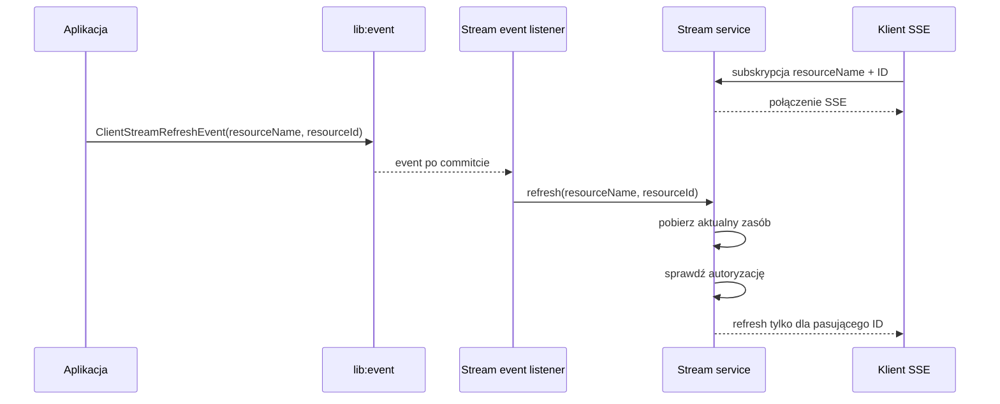

# Stream

Stream udostępnia klientowi odczytowy kanał SSE. Klient subskrybuje jeden albo
wiele identyfikatorów zasobu, a po zmianie otrzymuje tylko aktualizację
pasującego zasobu.

Biblioteka nie aktualizuje danych biznesowych. Zmiana jest zgłaszana przez
event, a Stream pobiera aktualny stan zasobu i wysyła go do właściwych
subskrybentów.

## Instalacja

Aplikacja korzysta z publicznego modułu:

```kotlin
dependencies {
    implementation(project(":lib:stream:api"))
}
```

Aplikacja nie musi zależeć bezpośrednio od `stream:common` ani
`stream:core`.

## Pierwsze użycie

Do uruchomienia Stream aplikacja dostarcza:

1. reader zasobu;
2. autoryzację odczytu;
3. publikację `ClientStreamRefreshEvent` po udanej zmianie biznesowej.

### 1. Reader zasobu

Reader mówi bibliotece, jak pobrać aktualny zasób po jego nazwie i ID:

```java
@Component
final class ClaimStreamReader implements ClientStreamResourceReader<ClaimDto> {

    @Override
    public String resourceName() {
        return "claims";
    }

    @Override
    public ClaimDto resource(String resourceId) {
        return claimQuery.findById(resourceId).orElse(null);
    }
}
```

`resourceName` musi być unikalne w aplikacji. Reader zwraca aktualny stan
zasobu, a nie event ani obiekt SSE.

### 2. Autoryzacja

Aplikacja decyduje, czy bieżący użytkownik może czytać konkretny zasób:

```java
@Bean
ClientStreamAuthorization streamAuthorization(ClaimAccess claimAccess) {
    return (resourceName, resourceId) ->
            claimAccess.canRead(resourceName, resourceId);
}
```

Autoryzacja jest sprawdzana przy tworzeniu subskrypcji oraz przed wysłaniem
refreshu.

### 3. Subskrypcja klienta

Jeden zasób:

```http
GET /streams/claims/123
Accept: text/event-stream
```

Kilka zasobów:

```http
GET /streams/claims?ids=123&ids=456
Accept: text/event-stream
```

W przeglądarce klient może użyć `EventSource`:

```javascript
const stream = new EventSource("/streams/claims/123");

stream.addEventListener("refresh", event => {
    const claim = JSON.parse(event.data);
    renderClaim(claim);
});
```

## Jak działa subskrypcja

Subskrypcja określa:

- nazwę zasobu;
- zbiór identyfikatorów;
- połączenie SSE klienta.

### Jeden ID

`GET /streams/{resourceName}/{resourceId}`:

- sprawdza autoryzację;
- rejestruje połączenie;
- pobiera aktualny zasób;
- wysyła początkowy event `refresh`, jeśli reader zwróci dane;
- czeka na kolejne zmiany.

### Wiele ID

`GET /streams/{resourceName}?ids=id1&ids=id2`:

- sprawdza autoryzację dla każdego ID;
- rejestruje jedną subskrypcję z wybranymi ID;
- nie wysyła początkowego snapshotu kolekcji;
- czeka na eventy dotyczące wybranych ID.

Przykład: subskrypcja `123,456` otrzyma refresh dla `123`, ale nie otrzyma
refreshu dla `789`.

Puste ID, brak parametru `ids`, brak uprawnień albo przekroczenie limitu
subskrypcji kończy się błędem HTTP. Domyślne limity to 100 ID w jednej
subskrypcji i 1000 aktywnych subskrypcji.

## Jak działa refresh

Po udanej zmianie biznesowej aplikacja publikuje event:

```java
eventPublisher.publish(
        new ClientStreamRefreshEvent("claims", claimId)
);
```

Event zawiera tylko:

- `resourceName`;
- `resourceId`.

Nie zawiera payloadu zasobu. Dzięki temu event pozostaje małym sygnałem
„zasób się zmienił”, a aktualny stan jest pobierany dopiero po zakończeniu
transakcji.

Po odebraniu eventu biblioteka:

1. odbiera event po commitcie transakcji;
2. wyszukuje reader dla `resourceName`;
3. pobiera aktualny zasób po `resourceId`;
4. ponownie sprawdza autoryzację;
5. wysyła event tylko do subskrypcji zawierających to ID.

Event SSE ma nazwę `refresh`:

```text
event: refresh
data: <serialized resource payload>
```

## Ogólny przepływ



## Konfiguracja

Domyślna ścieżka to `/streams`. Można ją zmienić przez
`ravcube.stream.path`.

```yaml
ravcube:
  stream:
    path: /streams
    timeout: PT30M
    max-ids-per-subscription: 100
    max-subscriptions: 1000
```

## Ważne zachowanie

SSE jest kanałem bieżących powiadomień, a nie trwałym magazynem eventów.

Po reconnect klient powinien ponownie pobrać aktualny stan przez zwykłe,
autoryzowane API. Obecny transport `lib:event` działa lokalnie w procesie,
dlatego event trafi tylko do klientów podłączonych do tej samej instancji
aplikacji.
