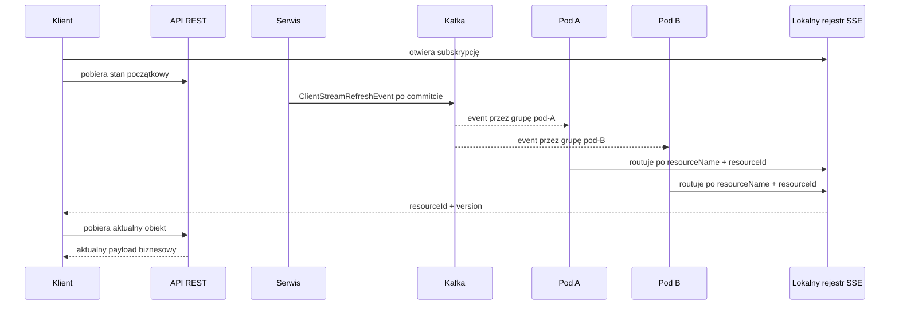
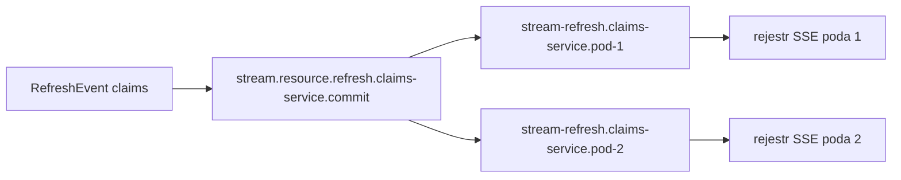

# Stream

## Model działania

Stream jest kanałem powiadomień SSE. Nie przesyła obiektu biznesowego i nie
pobiera go za aplikację.

Po zmianie zasobu klient dostaje tylko:

```json
{
  "resourceId": "123",
  "version": 42
}
```

Następnie klient sam wykonuje zwykły, autoryzowany request REST po aktualny
obiekt. Dzięki temu Stream nie musi znać modelu domenowego, serializować payloadu
biznesowego ani wykonywać autoryzacji danych.

Najważniejszy przepływ wygląda tak:



## Dlaczego Kafka, a nie lokalny event Springa

Lokalny event Springa działa tylko w jednej JVM. Jeżeli klient jest podłączony
do poda A, a zmiana zostanie obsłużona przez pod B, rejestr SSE poda A nie
otrzymałby informacji o zmianie.

W Stream Spring jest używany wyłącznie jako mechanizm uruchomienia publikacji
po `AFTER_COMMIT`. Właściwe dostarczenie między podami odbywa się przez Kafka:

1. aplikacja wywołuje publiczny `EventPublisher`;
2. publisher Stream oczekuje na zakończenie transakcji;
3. po commitcie event trafia na topic Kafka;
4. każdy pod odbiera własną kopię eventu;
5. pod aktualizuje tylko swoje lokalne połączenia SSE.

To oznacza, że Stream nie używa już lokalnego `DefaultCommitPublisher` ani
lokalnego listenera Springowego do dostarczania refreshu.

## Izolacja serwisów i podów

Kafka dostarcza rekord raz na grupę konsumencką, a nie raz do każdego procesu.
Dlatego Stream używa dwóch identyfikatorów:

- `service-name` — określa topic całego serwisu; domyślnie pochodzi z
  `spring.application.name`;
- `instance-id` — określa grupę konkretnego poda; domyślnie pochodzi z
  Kubernetesowego `HOSTNAME`.

Dla konfiguracji:

```yaml
ravcube:
  stream:
    kafka:
      service-name: claims-service
      instance-id: pod-1
```

powstają:

```text
topic:          stream.resource.refresh.claims-service.commit
consumer group: stream-refresh.claims-service.pod-1
```

Dwa pody tego samego serwisu:



Każdy pod musi mieć:

- ten sam `service-name`;
- inny `instance-id`.

Jeżeli wszystkie pody użyją tej samej grupy, Kafka rozdzieli eventy między pody
i wymaganie nie zostanie spełnione. Jeżeli każdy pod użyje innego
`service-name`, powstaną różne topici i pody nie będą słuchały wspólnego
kanału.

Inny serwis, np. `payments-service`, ma własny topic:

```text
stream.resource.refresh.payments-service.commit
```

Nie zmieniaj globalnego `spring.kafka.consumer.group-id`. Konfiguracja Stream
jest ograniczona do `ravcube.stream.kafka`, dlatego nie wpływa na pozostałe
eventy używane przez aplikację.

## Instalacja

Aplikacja korzysta z publicznego modułu:

```kotlin
dependencies {
    implementation(project(":lib:stream:api"))
}
```

Aplikacja nie musi zależeć bezpośrednio od `stream:common` ani
`stream:core`.

## Konfiguracja

Publiczny moduł `stream:api` zawiera domyślny plik profilu
`application-stream.yml`. Po aktywowaniu profilu `stream` Spring ładuje z niego
poniższe wartości:

```yaml
spring:
  application:
    name: claims-service
  profiles:
    active:
      - stream
      - kafka

ravcube:
  stream:
    path: /streams
    timeout: PT30M
    max-ids-per-subscription: 100
    max-subscriptions: 1000
```

Komponenty zachowują te same wartości fallback także wtedy, gdy aplikacja nie aktywuje profilu `stream`. Zalecane jest jednak jawne aktywowanie profilu dla używanego modułu.

Biblioteka automatycznie:

- użyje `spring.application.name` jako `service-name`;
- użyje Kubernetesowego `HOSTNAME` jako `instance-id`;
- zbuduje topic i grupę konsumencką bez konfiguracji per pod.

Własne wartości można ustawić w konfiguracji aplikacji. Konfiguracja aplikacji
ma pierwszeństwo przed wartościami dostarczonymi przez bibliotekę:

```yaml
ravcube:
  stream:
    path: /custom-streams
    timeout: PT10M
    max-ids-per-subscription: 50
    max-subscriptions: 500
```

Niezależnie można nadpisać konfigurację Kafka:

```yaml
ravcube:
  stream:
    kafka:
      service-name: custom-claims-service
      instance-id: custom-instance-id
```

`service-name` musi być stabilne dla jednego serwisu i takie samo we
wszystkich jego podach. `instance-id` musi być unikalne dla każdego poda.
Jeżeli `HOSTNAME` nie jest dostępne, biblioteka wygeneruje identyfikator losowy.

## Kubernetes

W Kubernetes nie konfigurujesz osobno każdego poda. Wystarczy ustawić nazwę
aplikacji na poziomie Deploymentu:

```yaml
spec:
  template:
    spec:
      containers:
        - name: claims
          image: claims:latest
          env:
            - name: SPRING_APPLICATION_NAME
              value: claims-service
```

Kubernetes automatycznie nada każdej replice unikalną nazwę poda i ustawia ją
w `HOSTNAME`. Dla trzech replik biblioteka otrzyma więc logicznie:

```text
spring.application.name = claims-service
HOSTNAME               = claims-7d8c9f6d4b-a1b2c
HOSTNAME               = claims-7d8c9f6d4b-d3e4f
HOSTNAME               = claims-7d8c9f6d4b-g5h6j
```

W efekcie wszystkie pody użyją wspólnego topicu, ale automatycznie utworzą
różne grupy konsumenckie. Nie ustawiaj `instance-id` jako stałej wartości w
ConfigMap, ponieważ wtedy wszystkie pody użyłyby tej samej grupy Kafka.

## Publikacja zmiany

Event należy opublikować po zmianie biznesowej, w tej samej transakcji:

```java
eventPublisher.publish(
        new ClientStreamRefreshEvent(
                "claims",
                claimId,
                claimVersion
        )
);
```

Event zawiera:

- `resourceName` — nazwę zasobu używaną do routingu;
- `resourceId` — identyfikator zmienionego zasobu;
- `version` — aktualną wersję ze źródła prawdy.

`version` nie jest generowana przez Stream. Nie należy umieszczać w evencie
payloadu biznesowego.

Publikacja działa po commitcie. Jeżeli transakcja zostanie wycofana, refresh
nie powinien zostać wysłany do Kafka.

## Subskrypcja SSE

Jeden zasób:

```http
GET /streams/claims/123
Accept: text/event-stream
```

Wiele zasobów:

```http
GET /streams/claims?ids=123&ids=456
Accept: text/event-stream
```

Oba warianty używają tego samego modelu subskrypcji: nazwa zasobu oraz zbiór
identyfikatorów. Stream nie wysyła initial snapshotu. Klient powinien pobrać
stan początkowy przez REST.

Przykład klienta:

```javascript
const stream = new EventSource("/streams/claims?ids=123&ids=456");

stream.addEventListener("refresh", async event => {
    const notification = JSON.parse(event.data);
    const response = await fetch("/claims/" + notification.resourceId);

    if (response.status === 404) {
        removeClaim(notification.resourceId);
        return;
    }

    renderClaim(await response.json());
});
```

Powiadomienie SSE ma format:

```text
event: refresh
data: {"resourceId":"123","version":42}
```

Stream nie sprawdza uprawnień do danych biznesowych. Za autoryzację i filtrację
payloadu odpowiada endpoint REST aplikacji. W założeniu identyfikator zasobu nie
jest daną wrażliwą.

Puste ID, brak parametru `ids` albo przekroczenie limitów kończy się błędem
HTTP. Domyślne limity to 100 ID w jednej subskrypcji i 1000 aktywnych
subskrypcji.

## Co dzieje się po reconnect

Kafka nie jest magazynem stanu SSE. Stream informuje o zmianie, ale nie gwarantuje
odtworzenia wszystkich powiadomień dla klienta.

Po reconnect klient powinien:

1. ponownie otworzyć subskrypcję;
2. pobrać aktualny stan przez REST;
3. używać `version` do pominięcia starszego lokalnego stanu, jeżeli aplikacja
   utrzymuje wersjonowanie po stronie klienta.

Jeżeli zasób został usunięty, request REST może zwrócić `404` i klient powinien
usunąć go z lokalnego widoku.

## Testowanie

Testy `stream:core` sprawdzają routing SSE, limity, cleanup i wysyłanie
powiadomień bez HTTP, Spring eventów ani Kafka.

Testy `stream:api` sprawdzają pełny przepływ:

```text
HTTP subscription
    -> EventPublisher
    -> AFTER_COMMIT
    -> Kafka Testcontainer
    -> Kafka listener
    -> lokalny rejestr SSE
    -> HTTP SSE client
```

Do testów Kafka używany jest istniejący moduł `test:kafka`. Nie należy zastępować
tego przepływu mockami, ponieważ najważniejszym kontraktem jest izolacja topicu,
grup konsumenckich i serializacji eventu.

SSE jest kanałem bieżących powiadomień, a nie trwałym magazynem eventów.
