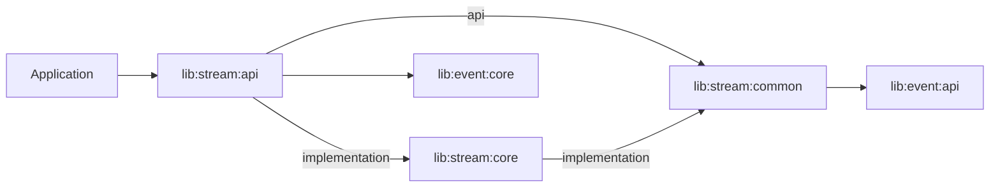
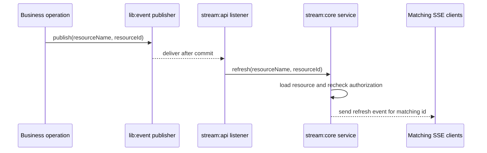

# Stream

The Stream modules provide a read-only Spring MVC implementation for
server-sent events (SSE). Resource refreshes are triggered only by the existing
`lib:event` module.

## Modules

```text
lib:stream:common
lib:stream:api
lib:stream:core
```

The dependency direction is:



`lib:stream:common` contains all shared contracts: external read interfaces and
the refresh event. `lib:stream:api` is the public facade used by applications:
it re-exports `common` and brings the `core` implementation at runtime.
The API module contains the Spring MVC controller and event adapters; they call
the application service from `lib:stream:core`. The core module contains the
service, SSE registry, read handlers, and domain rules.

```text
lib/stream/common/src/main/java/com/ravcube/lib/stream
  api/                                # shared read contracts
    ClientStreamResourceReader.java
    ClientStreamAuthorization.java
  common/event/
    ClientStreamRefreshEvent.java     # shared event contract

lib/stream/api/build.gradle.kts        # public facade: common + core runtime
lib/stream/api/src/main/java/com/ravcube/lib/stream
  web/                                # read-only HTTP/SSE controller
  event/                              # lib:event adapters using core service

lib/stream/core/src/main/java/com/ravcube/lib/stream
  application/                         # service, resource catalog and limits
  infrastructure/config/              # runtime properties
  infrastructure/sse/                  # SseEmitter registry
  domain/                              # subscription rules
```

An external application depends only on the facade:

```kotlin
dependencies {
    implementation(project(":lib:stream:api"))
}
```

## Read contracts

An application provides a reader for each resource type:

```java
import com.ravcube.lib.stream.api.ClientStreamResourceReader;

@Component
final class PolicyClaimStream implements ClientStreamResourceReader<PolicyClaimDto> {

    @Override
    public String resourceName() {
        return "policies.claims";
    }

    @Override
    public PolicyClaimDto resource(String resourceId) {
        return claimQuery.load(resourceId);
    }
}
```

The application also provides resource-level authorization:

```java
@Bean
ClientStreamAuthorization streamAuthorization(ClaimAccess claimAccess) {
    return (resourceName, resourceId) ->
            claimAccess.canRead(CurrentUserContext.current(), resourceName, resourceId);
}
```

These contracts are read-only. They do not publish refreshes and do not expose
SSE implementation details.

## Refresh event

A successful business operation publishes the shared event through the
existing event module:

```java
import com.ravcube.lib.event.inteface.EventPublisher;
import com.ravcube.lib.stream.common.event.ClientStreamRefreshEvent;

eventPublisher.publish(new ClientStreamRefreshEvent("policies.claims", claimId));
```

`stream:api` contains the event adapter and registers the listener using
`DefaultCommitPublisher` and `DefaultCommitListener`. The listener receives the
event after commit and delegates to `stream:core`, which loads the current
resource, rechecks access for every SSE subscription, and sends one `refresh`
event to matching resource ids.

The event contains only `resourceName` and `resourceId`; the payload is loaded
after commit and is not transported through the event bus.

The refresh flow is:



## HTTP endpoints

The default base path is `/streams`. Override it with
`ravcube.stream.path`. The emitter timeout defaults to `PT30M` and can be
changed with `ravcube.stream.timeout`. Resource limits default to 100 ids per
subscription and 1000 active subscriptions:

```yaml
ravcube:
  stream:
    timeout: PT30M
    max-ids-per-subscription: 100
    max-subscriptions: 1000
```

| Method | Endpoint | Behavior |
| --- | --- | --- |
| `GET` | `/streams/{resourceName}/{resourceId}` | subscribes to one resource and sends an initial `refresh` event when a reader returns a payload |
| `GET` | `/streams/{resourceName}?ids=1&ids=2` | subscribes to selected resource ids |

There is no update endpoint and no Feign update client. Refreshes enter the
module only as `ClientStreamRefreshEvent` events.

## SSE event format

Every refresh uses the event name `refresh`:

```text
event: refresh
data: <serialized resource payload>
```

SSE is a live notification channel, not a durable event store. After a
reconnect, the client should load the current resource through the normal
authorized read API. The selected-ids endpoint is a notification subscription
and does not send an initial collection snapshot.

The current `lib:event` Spring transport is process-local. The stream module
therefore delivers events only to subscribers connected to the same application
instance. A multi-instance deployment requires a distributed event transport
decision outside this read-only stream module.
