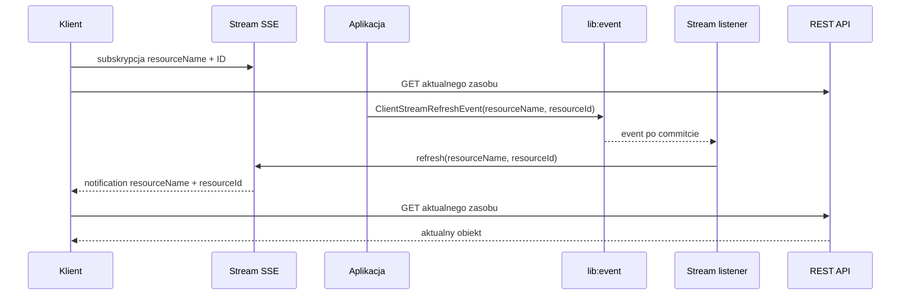

# Stream

Stream udostępnia klientowi odczytowy kanał SSE. Jest to lekki informator o
zmianie zasobu, a nie kanał przesyłający obiekty biznesowe.

Klient subskrybuje jeden albo wiele identyfikatorów. Po zmianie otrzymuje
`resourceName` i `resourceId`, a następnie pobiera aktualny obiekt przez
zwykłe, autoryzowane API REST.

## Instalacja

Aplikacja korzysta z publicznego modułu:

```kotlin
dependencies {
    implementation(project(":lib:stream:api"))
}
```

Aplikacja nie musi zależeć bezpośrednio od `stream:common` ani
`stream:core`.

## Pierwsze użycie

Aplikacja dostarcza:

1. autoryzację odczytu zasobu;
2. publikację `ClientStreamRefreshEvent` po udanej zmianie biznesowej;
3. zwykły endpoint REST, z którego klient pobierze aktualny obiekt.

### Autoryzacja

```java
@Bean
ClientStreamAuthorization streamAuthorization(ClaimAccess claimAccess) {
    return (resourceName, resourceId) ->
            claimAccess.canRead(resourceName, resourceId);
}
```

### Subskrypcja i odczyt

```javascript
const stream = new EventSource("/streams/claims?ids=123&ids=456");

stream.addEventListener("refresh", async event => {
    const notification = JSON.parse(event.data);
    const response = await fetch("/claims/" + notification.resourceId);

    if (response.status === 404) {
        removeClaim(notification.resourceId);
        return;
    }

    renderClaim(await response.json());
});
```

Stream nie zna ścieżki REST aplikacji. Odpowiada wyłącznie za subskrypcję i
powiadomienie o zmianie.

## Jak działa subskrypcja

Subskrypcja określa:

- nazwę zasobu;
- zbiór identyfikatorów;
- połączenie SSE klienta.

Jeden zasób:

```http
GET /streams/claims/123
Accept: text/event-stream
```

Kilka zasobów:

```http
GET /streams/claims?ids=123&ids=456
Accept: text/event-stream
```

Oba warianty mają ten sam format eventu. Stream nie wysyła initial snapshotu.
Klient powinien pobrać stan początkowy przez REST.

Puste ID, brak parametru `ids`, brak uprawnień albo przekroczenie limitu
subskrypcji kończy się błędem HTTP. Domyślne limity to 100 ID w jednej
subskrypcji i 1000 aktywnych subskrypcji.

## Jak działa refresh

Po udanej zmianie biznesowej aplikacja publikuje event przez istniejący moduł
`lib:event`:

```java
eventPublisher.publish(
        new ClientStreamRefreshEvent("claims", claimId)
);
```

`ClientStreamRefreshEvent` zawiera tylko:

- `resourceName`;
- `resourceId`.

Nie zawiera payloadu zasobu. Po odebraniu eventu po commitcie biblioteka:

1. przekazuje sygnał do rejestru SSE;
2. sprawdza, czy identyfikator pasuje do subskrypcji;
3. sprawdza autoryzację;
4. wysyła klientowi lekkie powiadomienie.

SSE ma zawsze jeden format:

```text
event: refresh
data: {"resourceName":"claims","resourceId":"123"}
```

Aktualny obiekt jest pobierany dopiero przez REST klienta.

## Ogólny przepływ



## Konfiguracja

Domyślna ścieżka to `/streams`. Można ją zmienić przez
`ravcube.stream.path`.

```yaml
ravcube:
  stream:
    path: /streams
    timeout: PT30M
    max-ids-per-subscription: 100
    max-subscriptions: 1000
```

## Ważne zachowanie

SSE jest kanałem bieżących powiadomień, a nie trwałym magazynem eventów.

Po reconnect klient powinien ponownie pobrać aktualny stan przez zwykłe,
autoryzowane API. Obecny transport `lib:event` działa lokalnie w procesie,
dlatego event trafi tylko do klientów podłączonych do tej samej instancji
aplikacji.
